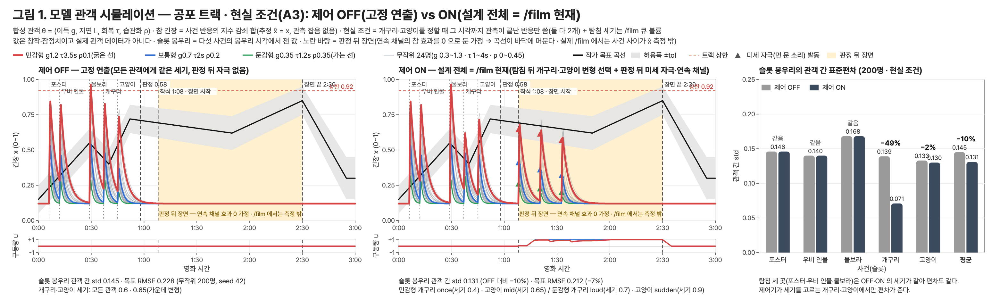

# 궤적 추종 연출 엔진: 기술 요약

7조 버스정류장(KAIST·KOCCA 캡스톤) · 2026-09-30 · 괄호 속 기호(A3, B3 …)는 수치 표 [`기술요약_수치표.md`](기술요약_수치표.md)의 행 번호이며, 이 요약의 숫자는 모두 그 표에서 가져왔습니다.

> 사본 안내: 이 문서의 원본은 증거물 폴더의 `tech-summary.md`입니다. `sim/…`·`b21/…` 처럼 적힌 경로는 저장소 밖 증거물 폴더(`work/evidence/`) 기준이며, 수치는 `npm run sim:plot` 과 `기술요약_수치표.md` 의 재현 명령으로 다시 낼 수 있습니다.

> **전제.** 아래 실험의 관객은 모두 합성 관객(수식으로 만든 모델 관객, 또는 합성 시선)이며 실제 사람의 데이터는 아직 없습니다(E3). 따라서 결과는 실제 관객에게 효과가 있다는 증거가 아니라, 엔진의 세 부분(관객 모델·긴장 추정·제어기)이 설계대로 함께 동작한다는 증거입니다.

## 문제

VR 단편 「버스정류장」은 작가가 트랙(공포·로맨스·블랙코미디)마다 긴장 곡선을 설계합니다. 그러나 관객마다 반응의 크기, 반응까지 걸리는 시간, 가라앉는 속도, 반복될 때 무뎌지는 정도가 달라서, 모든 관객에게 같은 연출을 보여 주면 곡선을 따라가는 관객과 벗어나는 관객이 함께 나타납니다. 고정 연출에서 사건 직후 긴장 봉우리의 관객 간 표준편차는 현실 조건에서 0.145, 이상 조건에서 0.121 입니다(A3·A1). 기존 반응형 콘텐츠 특허의 청구항은 측정한 감정과 목표의 현재 차이로 콘텐츠를 보정하는 데 머물며, 관객별 반응 동역학으로 변형 후보마다 반응을 예측해 비교하지는 않습니다.

## 방법

센서는 HMD 의 머리 방향 하나뿐이며, 뇌파·피부전도 같은 생체 센서를 따로 붙이지 않습니다.

1. **관객 모델 식별.** 도입부 사건 세 개(포스터·우비 인물·물보라)는 모든 관객에게 같은 세기로 울리는 중립 탐침입니다(F1). 엔진은 사건마다 관객이 고개를 돌린 각도, 반응까지 걸린 시간, 움직임이 가라앉는 시간을 재서 관객별 응답 모델 θ = (이득 g, 지연 L, 회복 τ, 습관화 ρ)를 추정하고, 표본이 적으므로 추정값을 모집단 사전분포 쪽으로 수축시킵니다(F4). 탐침의 세기를 제어하면 그 응답으로 추정하는 θ 가 오염되므로, 탐침은 중립으로 둡니다.
2. **긴장 추정 x̂.** 각 사건 반응을 관객별 회복 시정수만큼 시간에 따라 줄어들게 한 뒤 모두 더하고, 그 값을 연속 긴장 추정값 x̂(t)로 씁니다.
3. **예측 기반 슬롯 제어(MPC).** 탐침 뒤의 두 슬롯(개구리 0:37, 고양이 0:43)에서 제어기는 θ̂ 로 변형 후보(볼륨·반복 횟수·고양이 동선)마다 앞으로의 긴장 궤적을 예측하고, 목표 편차와 서사 비용의 합이 가장 작은 변형을 실제로 울립니다(F1). 제어기는 이 예측에 채널 반복에 따른 습관화와 트랙별 긴장 상한을 반영합니다.
4. **판정 불확실성 헤지.** 장르 판정(0:58, B1) 전에는 세 트랙의 목표 곡선을 그 순간의 장르 확률로 가중 평균한 기대 곡선을 목표로 쓰고, 판정 뒤에 해당 트랙 곡선으로 확정합니다.
5. **판정 뒤 두 가지 제어 수단.** x̂ 가 목표보다 낮으면 먼 문 소리(미세 자극)를 넣고(최대 3회, F2), 대사 간격·BGM·가로등·안개·옆사람 거리·시선을 목표 부족분에 비례해 정해진 범위 안에서 천천히 조정합니다(F3).

팀의 판정 로직(헤드 포즈 장르 판정, /interim 5신호 판정, B1·C1)은 바꾸지 않았고, 엔진은 순수 함수 모듈과 회귀 테스트로 구현했습니다(F5).

## 실험

- **시뮬레이션(A).** 모델 관객 200명과 세 트랙에서 제어 OFF(고정 연출)와 ON(설계 전체)을 비교합니다(A1). 슬롯을 결정하는 시각까지 관측이 끝난 응답만 쓰는 현실 조건을 대표값(A3)으로, 앞 탐침 응답을 모두 쓰는 이상 조건을 상한(A2)으로 둡니다.
- **/film 1배속 헤드리스 완주(B).** 합성 공포형 seed 1 로 트랙을 공포로 고정하고 제어 ON 과 OFF 를 한 번씩 완주합니다(B1). 트랙을 고정하지 않으면 공포와 로맨스의 판정 차이가 0.4%p 안팎이라 같은 URL 에서도 판정이 바뀌기 때문입니다(D3). 그래서 연속 구동과 장면 비교에는 트랙을 고정한 녹화 쌍만 쓰고, 고정하지 않은 쌍은 판정 전 슬롯 결정이 반응을 바꾼다는 장면 증거로만 씁니다.
- **/interim 두 관객(C).** 팀이 만든 중간 시연 화면에서 합성 공포형과 차분형이 같은 다섯 사건을 봅니다. 여기서는 제어하지 않고 측정만 합니다.

## 결과

- **관객 간 편차가 줄었습니다(시뮬).** 제어 ON 은 OFF 대비 사건 봉우리의 관객 간 표준편차를 공포 10%, 로맨스 14%, 블랙코미디 8% 줄였고(공포 0.145 → 0.131), 목표 곡선 대비 RMSE 를 7%·7%·10% 줄였습니다(현실 조건, A3). 이상 조건의 상한은 16%·19%·14%입니다(A2). 편차가 주는 곳은 제어기가 세기를 고르는 개구리 슬롯(49% 감소)이고, 응답 두 개로 정하는 고양이 슬롯은 거의 줄지 않습니다(2% 감소, A7). 판정 뒤 장면의 RMSE 감소는 3~4%로 작습니다(A4).
- **제어기가 실제 연출을 바꿨습니다(/film).** 제어기는 개구리 소리를 한 번만, 볼륨 0.5로 울렸습니다(OFF 는 0.8, B2). 그러자 합성 관객은 개구리를 돌아보지 않고 움찔만 했고, 가장 크게 반응한 순간이 OFF 의 개구리(0:38)에서 ON 의 비명(0:53)으로 옮겨 갔습니다(B6). 판정 뒤에는 ON 이 OFF 보다 대사 간격을 0.45초, 옆사람 거리를 0.15m 늘리고 BGM 을 1.25배로 키웠으며(B3), 늘어난 간격이 쌓여 같은 URL 의 ON 완주 세 번이 모두 OFF 보다 6~16초 길었습니다(B4). 미세 자극은 ON 에서 3회, OFF 에서 0회 울렸습니다(B5).
- **같은 다섯 사건을 보고도 두 관객이 갈렸습니다(/interim).** 공포형은 θ̂ 이득 1.142·응답 5/5, 차분형은 이득 0.385·응답 1/5 이고(C2), 팀 판정도 공포 5점과 로맨스 5점으로 갈렸습니다(C1). 종료 카드의 반응 지문 문장도 서로 다르며, 반응이 3건 미만인 차분형에게는 성향을 단정하지 않는 문장을 보여 줍니다(C5).

## 신규성: 선행 특허와의 차이

- **Dolby [US11477525B2](https://patents.google.com/patent/US11477525B2/en)** (우선일 2018-10-01, 등록 2022-10-18). 제작 의도로 만든 "기대 생리 상태"와 생리 신호로 평가한 상태가 어긋나면 같은 콘텐츠를 수정해 재생합니다. 관객별 반응 동역학 모델, 미래 궤적 예측, 변형 후보 비교는 청구항에 없습니다.
- **Warner Bros. [US11303976B2](https://patents.google.com/patent/US11303976B2/en)** (우선일 2017-09-29, 등록 2022-04-12). 목표 감정 아크와 감정 프로필이 붙은 디지털 오브젝트를 두고, 생체 센서로 구한 감정 상태와 아크의 현재 값으로 오브젝트를 고릅니다. 첫 번째 독립항에는 관객별 지연·회복·습관화 모델과 관객 간 편차 목표가 없습니다. 명세서에는 기계학습 예측이 언급되므로, 우리 엔진과의 차이는 무엇을 어떻게 예측하는지에 둡니다.
- **우리 엔진이 더하는 것.** ① 짧은 중립 탐침으로 관객별 저차 동역학 θ(이득·지연·회복·습관화)를 온라인으로 식별하며, 식별 구간에서는 자극을 바꾸지 않습니다. ② θ̂ 로 변형 후보마다 미래 긴장 궤적을 계산해 고르고, 습관화를 예측에 넣습니다. ③ 목표 곡선이 장르 판정의 불확실성을 반영합니다(판정 전 확률 가중 기대 곡선, 판정 뒤 확정). 두 특허는 목표를 콘텐츠에 고정합니다. ④ 평가 지표를 개인 오차가 아니라 관객 간 궤적 편차에 둡니다. ⑤ 생체 센서 없이 HMD 머리 방향만 씁니다. 정식 선행 기술 조사는 변리사의 몫이며, 발표·전시로 공개하기 전에 출원 여부를 정해야 합니다.

## 한계

- 실제 사람의 데이터가 없습니다(E3). 시뮬레이션은 모델 관객의 참 반응이 추정기의 수식과 같고 관측 잡음이 없으므로, 결과를 상한으로 읽어야 합니다(E4).
- 판정 뒤 장면에서 관객의 긴장이 목표 곡선을 따라갔는지는 지금 재지 못합니다. x̂ 는 사건 반응만 재므로 사건 사이 구간은 측정 밖이며, 허용폭 안에 든 창은 0/40 입니다(E1). 따라서 연속 구동은 측정되지 않는 구간의 x̂ 로 구동량을 올리는 개루프 보정입니다(A6). 공포 트랙에서는 가로등이 이미 켜져 있어 가로등 축이 움직이지 않습니다(B3).
- 합성 공포형의 사건 반응은 x̂ 상한 1.0 에 자주 닿습니다(E2). 판정 전 두 슬롯 결정은 응답 2개만으로 θ̂ 를 적합하며, 그중 고양이 결정은 관객을 거의 가르지 못합니다(E5·A7). 팀 판정은 경계 사례에서 흔들리고(D3), 배속 완주의 판정은 쓰지 않습니다(E6).

**다음 단계.** 실제 관객 파일럿(제어 ON/OFF 무작위 배정, 회고식 자기보고)으로 θ 사전분포와 연속 채널의 실제 효과를 잽니다. 그 전까지 위 수치는 설계 검증으로만 인용합니다.

증거물: 시뮬 그림 `sim/sim-onoff.png` · 디렉터 모니터 시연 영상 `b22a/film-monitor-demo-1x-1280.mp4` · 트랙 고정 ON/OFF 완주 쌍(모니터 문구는 옛 판) `b21/` · 두 관객 비교 화면과 ON/OFF 비교 화면(PNG 와 훑는 영상) `b22b/` · ON/OFF 종료 카드 `b23a/pair-end.png`
